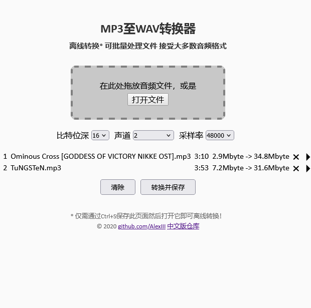

# MP3至WAV转换器

## 本仓库为[AlexIII/web-wav-converter/](https://github.com/AlexIII/web-wav-converter/)的汉化

- 可离线运行
- 可批量处理文件
- 接受大多数音频格式

[快来试试！](https://m2w.pzwboy.top)

### 说明

这是一个单页面的音频转换器，使用浏览器内的API将任何的音频文件转换为未压缩的PCM [WAV](https://zh.wikipedia.org/wiki/WAV)文件。

该界面允许在转换之前更改采样率、比特位深和声道，并可预听文件在新设置下的音效。

用于离线使用时，只需下载`index.html`文件，然后在浏览器中打开它即可。

## 这用途是什么？

这个项目的主要用途是将音频文件转换为可在嵌入式环境中使用的格式，因为在嵌入式环境中无法运行音频解压缩算法。

## Chrome浏览器用户请注意：

建议在火狐浏览器中使用此转换器。火狐浏览器使用的处理算法在提供比Chrome更好的重采样质量方面表现得尤为出色，尤其是在低采样率（例8000）的情况下。

## 许可证

MIT License © github.com/AlexIII
